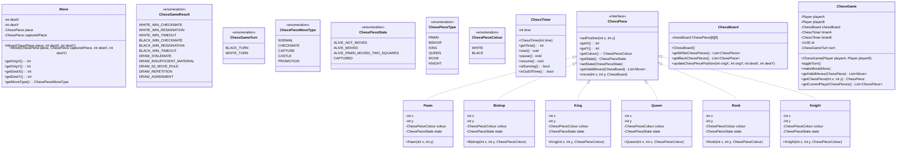

# SimplyChess

A robust yet simple and comprehensive implementation of the infamous game "Chess"

## UML Diagram

```mermaid
classDiagram

class Move {
    -int destX
    -int destY
    -ChessPiece piece
    -ChessPiece capturedPiece
    +Move(ChessPiece piece, int destX, int destY)
    +Move(ChessPiece piece, ChessPiece capturedPiece, int destX, int destY)
    +getOrigX(): int
    +getOrigY(): int
    +getDestX(): int
    +getDestY(): int
    +getMoveType(): ChessPieceMoveType
}

class ChessGameResult {
    <<enumeration>>
    WHITE_WIN_CHECKMATE
    WHITE_WIN_RESIGNATION
    WHITE_WIN_TIMEOUT
    BLACK_WIN_CHECKMATE
    BLACK_WIN_RESIGNATION
    BLACK_WIN_TIMEOUT
    DRAW_STALEMATE
    DRAW_INSUFFICIENT_MATERIAL
    DRAW_50_MOVE_RULE
    DRAW_REPETITION
    DRAW_AGREEMENT
}

class ChessGameTurn {
    <<enumeration>>
    BLACK_TURN
    WHITE_TURN
}

class ChessPieceMoveType {
    <<enumeration>>
    NORMAL
    CHECKMATE
    CAPTURE
    CASTLE
    PROMOTION
}

class ChessPieceState {
    <<enumeration>>
    ALIVE_NOT_MOVED
    ALIVE_MOVED
    ALIVE_PAWN_MOVED_TWO_SQUARES
    CAPTURED
}

class ChessPieceType {
    <<enumeration>>
    PAWN
    BISHOP
    KING
    QUEEN 
    ROOK
    KNIGHT
}

class ChessPieceColour {
    <<enumeration>>
    WHITE
    BLACK
}


class ChessTimer {
    -int time
    +ChessTimer(int time)
    +getTime(): int
    +start() void
    +pause() void
    +resume() void
    +isRunning(): bool
    +isOutOfTime(): bool
}

class ChessPiece{
    <<interface>>
    +setPosition(int x, int y)
    +getX(): int
    +getY(): int
    +getColour(): ChessPieceColour
    +getState() ChessPieceState 
    +setState(ChessPieceState)
    +getValidMoves(ChessBoard) List~Move~
    +move(int x, int y, ChessBoard)
}

class Pawn{
    -int x
    -int y
    -ChessPieceColour colour
    -ChessPieceState state
    +Pawn(int x, int y)
}

class Bishop{
    -int x
    -int y
    -ChessPieceColour colour
    -ChessPieceState state
    +Bishop(int x, int y, ChessPieceColour)
}


class King{
    -int x
    -int y
    -ChessPieceColour colour
    -ChessPieceState state
    +King(int x, int y, ChessPieceColour)
}

class Queen{
    -int x
    -int y
    -ChessPieceColour colour
    -ChessPieceState state
    +Queen(int x, int x, ChessPieceColour)
}


class Rook{
    -int x
    -int y
    -ChessPieceColour colour
    -ChessPieceState state
    +Rook(int x, int y, ChessPieceColour)
}


class Knight{
    -int x
    -int y
    -ChessPieceColour colour
    -ChessPieceState state
    +Knight(int x, int y, ChessPieceColour)
}

class ChessBoard {
    -chessBoard ChessPiece[8][8]
    +ChessBoard()
    +getWhiteChessPieces() List~ChessPiece~
    +getBlackChessPieces() List~ChessPiece~
    +updateChessPiecePosition(int origX, int origY, int destX, int destY)
}

class ChessGame {
    -Player playerA
    -Player playerB
    -ChessBoard chessBoard
    -ChessTimer timerA
    -ChessTimer timerB
    -UUID id
    -ChessGameTurn turn
    +ChessGame(Player playerA, Player playerB)
    -toggleTurn()
    +makeMove(Move)
    +getValidMoves(ChessPiece) List~Move~
    +getChessPiece(int x, int y) ChessPiece
    +getCurrentPlayerChessPieces() List~ChessPiece~
}

%% relationships
ChessPiece <|.. Pawn
ChessPiece <|.. Bishop 
ChessPiece <|.. King 
ChessPiece <|.. Queen
ChessPiece <|.. Rook 
ChessPiece <|.. Knight

```
